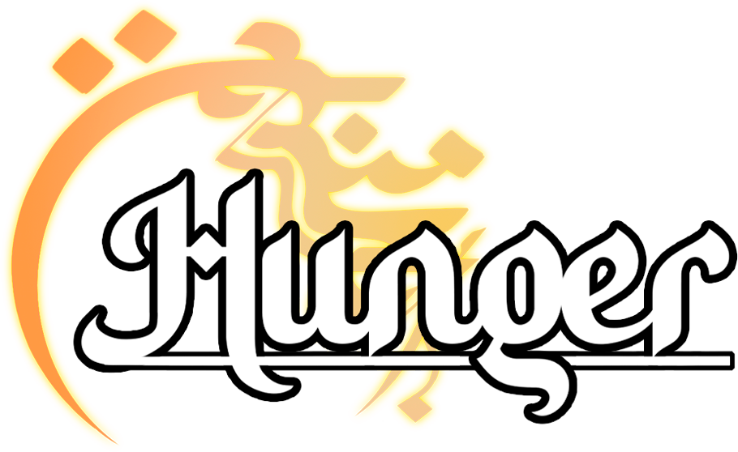

##Youtube: https://youtu.be/Vol31olD0_I?si=GYxnkKtAkYoHlBUQ (exhibition video)

## Game Title: Hunger

This game has been developed using a proprietary engine, leveraging the power of SDL2. The project emerged from coursework in game development at the University of Brasília (UNB).
- **Graphics Library:** SDL2 (Simple DirectMedia Layer)

### Credits:

#### Programming
- Felipe Dantas Borges

#### Art
- Yukito Rodrigues Kobayashi
- Yuri Bruno de Castro Rodrigues ([ArtStation](https://www.artstation.com/linenartt))
- Heitor Carvalho Fuscaldi ([ArtStation](https://www.artstation.com/hfuscaldi))

#### Game Design
- Pedro Velho Lira

### Soundtrack:

#### Songs by Vivek Abhishek:
- [Born Hero](https://www.youtube.com/watch?v=wrg2avhHQgA)
- [You Have Been Warned](https://www.youtube.com/watch?v=_TYI4xPoYaE)

#### Song by Aditya Verma, Subir Dev:
- [Kirwani - Teental](https://www.youtube.com/watch?v=ByEkfyzD4Rg)

### Sound Effects:

All sound effects used in the game have been sourced from [OpenGameArt.org](https://opengameart.org/) and are credited to the following:

- [Death Bell](https://opengameart.org/content/death-bell)
- [3 Melee Sounds](https://opengameart.org/content/3-melee-sounds)
- [Click](https://opengameart.org/content/click)
- [Energy Drain](https://opengameart.org/content/energy-drain)
- [Menu Selection Click](https://opengameart.org/content/menu-selection-click)
- [Punches, Hits, Swords, and Squishes](https://opengameart.org/content/punches-hits-swords-and-squishes)
- [Bell Sounds](https://opengameart.org/content/bell-sounds)

### How to Play:

- **Left Mouse Button:** Use the left mouse button to select objects or interact with the environment.

- **Right Mouse Button:** Press the right mouse button to deselect or cancel actions.
  
- **Arrow Keys; W and S keys:** Navigate the in-game map using the arrow keys.

### Installation:

1. **Download the Latest Release:**
   - Visit the [Releases](https://github.com/Felipedbbsb/Hunger-Game/releases) section of this repository.
   - Look for the latest version and download the associated ZIP file.

2. **Extract the ZIP File:**
   - After downloading, extract the contents of the ZIP file to a location of your choice.

3. **Run the Game:**
   - Navigate to the extracted folder.
   - Find the executable file (`.exe`) for the game.
   - Double-click on the executable file to launch the game.

Now you're ready to enjoy Hunger!

### Enjoy the Game!

